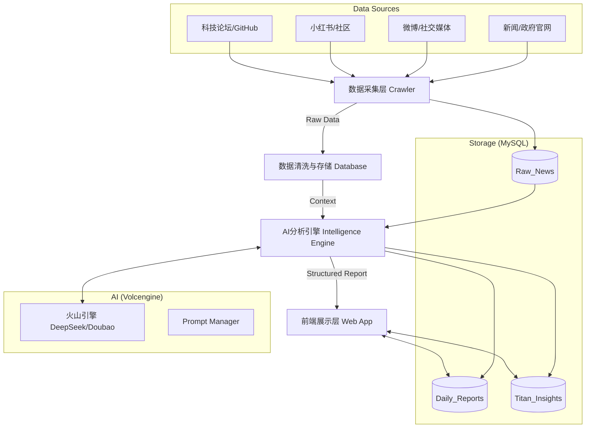

# Titan View / 巨头视野 - 技术落地文档 (Technical Specification)

## 1. 系统架构设计 (System Architecture)

系统采用 **ETL (Extract, Transform, Load)** 架构，结合 **LLM (Large Language Model)** 进行智能化处理。

### 1.1 架构图示


---

## 2. 技术栈选型 (Tech Stack)

*   **前端**：Next.js (React) + Tailwind CSS (快速构建现代UI)。
*   **后端**：Python (FastAPI) 或 Node.js (NestJS) - *推荐Python以便于集成爬虫和AI库*。
*   **数据库**：**MySQL 8.0+** (核心存储)。
*   **AI模型**：**字节跳动火山引擎 (Volcengine)** - 调用 DeepSeek 或 Doubao-pro 模型。
*   **爬虫**：Python (Playwright / Scrapy) + 代理池。
*   **定时任务**：Celery 或 APScheduler。

---

## 3. 数据库设计 (Database Schema - MySQL)

建议核心表结构如下：

### 3.1 原始资讯表 (`raw_news`)
存储每日爬取的全量信息。

```sql
CREATE TABLE raw_news (
    id BIGINT AUTO_INCREMENT PRIMARY KEY,
    source_platform VARCHAR(50) NOT NULL, -- 'weibo', 'xiaohongshu', 'reuters', 'gov'
    title VARCHAR(500) NOT NULL,
    content TEXT, -- 原始内容
    url VARCHAR(1000) UNIQUE, -- 原文链接，用于去重
    publish_time DATETIME, -- 发布时间
    crawl_time DATETIME DEFAULT CURRENT_TIMESTAMP,
    author VARCHAR(100),
    tags JSON, -- 原始标签
    status TINYINT DEFAULT 0 -- 0:未处理, 1:已处理
) ENGINE=InnoDB DEFAULT CHARSET=utf8mb4;
```

### 3.2 每日简报表 (`daily_reports`)
存储AI生成后的每日总结报告。

```sql
CREATE TABLE daily_reports (
    id BIGINT AUTO_INCREMENT PRIMARY KEY,
    report_date DATE NOT NULL UNIQUE, -- 报告日期
    summary_markdown MEDIUMTEXT, -- 完整的Markdown格式简报
    macro_score INT, -- 宏观评分
    tech_score INT, -- 科技评分
    created_at DATETIME DEFAULT CURRENT_TIMESTAMP
) ENGINE=InnoDB DEFAULT CHARSET=utf8mb4;
```

### 3.3 巨头洞察表 (`titan_insights`)
存储针对特定新闻的大佬视角解读。

```sql
CREATE TABLE titan_insights (
    id BIGINT AUTO_INCREMENT PRIMARY KEY,
    news_id BIGINT, -- 关联 raw_news
    persona VARCHAR(50), -- 'li_ka_shing', 'elon_musk'
    insight_text TEXT, -- AI生成的解读
    sentiment_score FLOAT, -- 情绪分 (-1 to 1)
    relevance_score FLOAT, -- 关联度 (0-10)
    FOREIGN KEY (news_id) REFERENCES raw_news(id)
) ENGINE=InnoDB DEFAULT CHARSET=utf8mb4;
```

---

## 4. 核心功能实现流程

### 4.1 数据采集 (Crawler Strategy)
*   **频率**：每日凌晨 4:00 - 6:00 执行。
*   **策略**：
    *   **微博**：抓取热搜榜 Top 50，过滤娱乐明星，保留财经/社会/科技类。
    *   **小红书**：搜索关键词 "消费"、"买房"、"裁员"、"AI"，抓取高赞笔记 (Top 20)。
    *   **新闻**：RSS订阅或API获取主流媒体头条。
*   **去重**：利用 `url` 字段做唯一索引，或对 `title` 做相似度计算。

### 4.2 AI 智能化处理 (AI Pipeline using Volcengine)
利用火山引擎 API 进行三步处理：

1.  **分类与清洗 (Classification)**
    *   *Input*: 原始新闻列表。
    *   *Prompt*: "请将以下新闻分类为：政策、国际、金融、科技、社会。并去除广告和重复内容。"
    
2.  **大佬视角过滤 (Persona Filtering)**
    *   *Input*: 清洗后的新闻 + 大佬Persona定义。
    *   *Prompt (李嘉诚版)*: "你现在是李嘉诚。请从这100条新闻中，找出对'资产安全'和'宏观周期'影响最大的3条。忽略娱乐和琐碎科技新闻。并给出你的简短评语。"
    *   *Prompt (马斯克版)*: "你现在是马斯克。请找出最能体现'效率提升'或'技术变革'的3条新闻。忽略传统低效行业的变动。"

3.  **生成简报 (Generation)**
    *   汇总上述结果，生成 Markdown 格式的日报。

### 4.3 接口设计 (API Endpoints)
*   `GET /api/daily-report?date=2023-10-27` : 获取某日简报。
*   `GET /api/news/filter?persona=li_ka_shing` : 获取某大佬视角的精选新闻流。
*   `POST /api/chat/ask-titan` : 提问大佬 (调用实时AI接口)。

---

## 5. 开发路线图 (Roadmap)

1.  **Phase 1 (数据基建)**: 搭建MySQL，跑通微博和小红书的简单爬虫，存入数据库。
2.  **Phase 2 (AI接入)**: 申请火山引擎Key，调试Prompt，实现每日自动生成简报文本。
3.  **Phase 3 (Web展示)**: 开发前端页面，展示Markdown日报，实现基础阅读体验。
4.  **Phase 4 (优化)**: 增加更多数据源，优化Persona的性格相似度。
